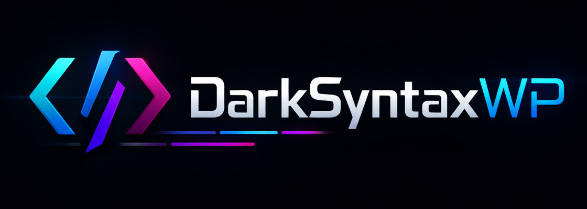
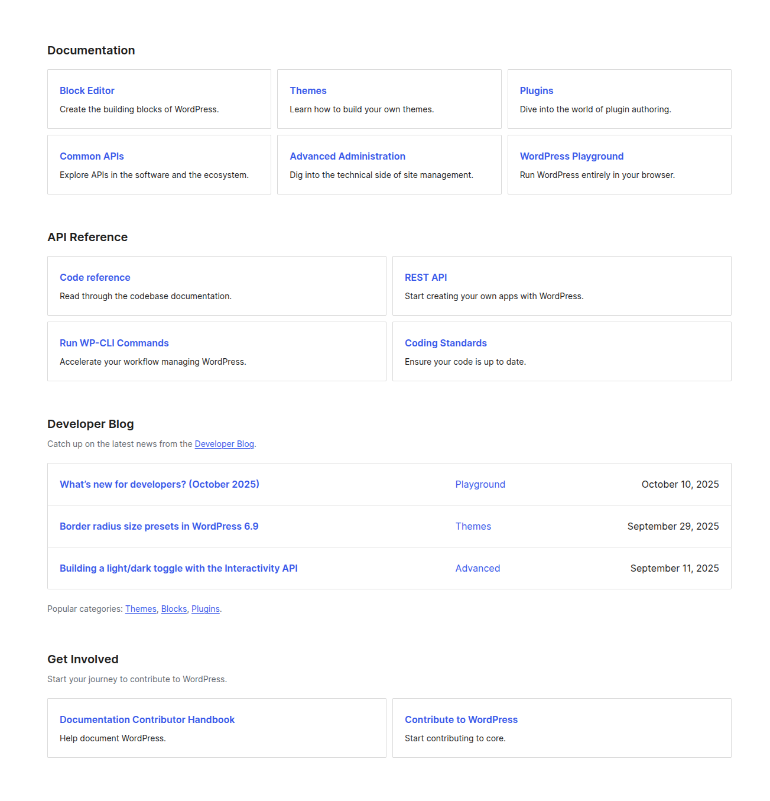
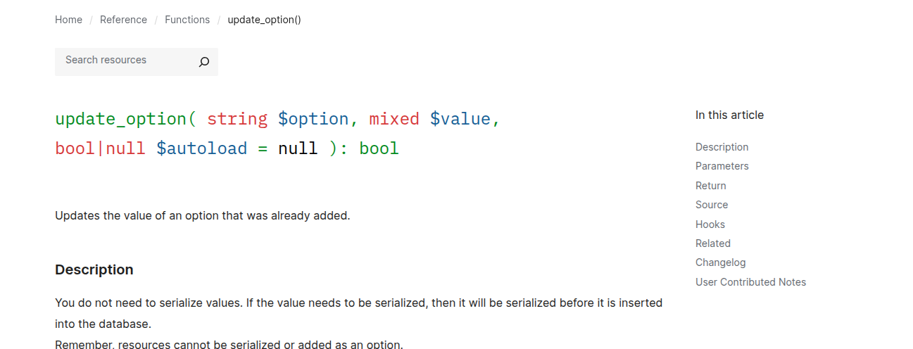
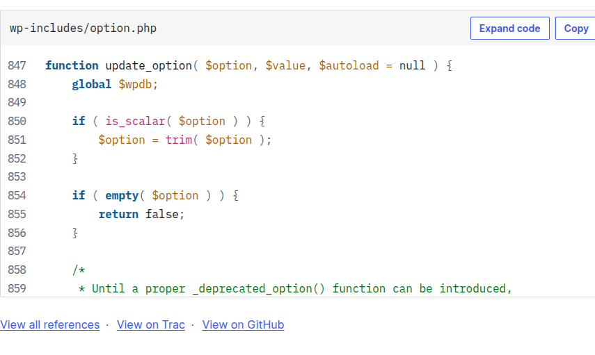
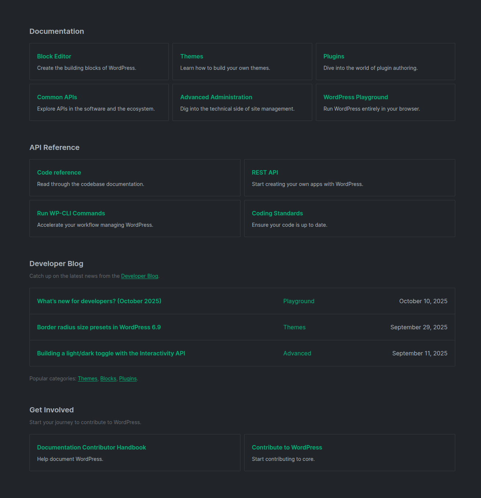
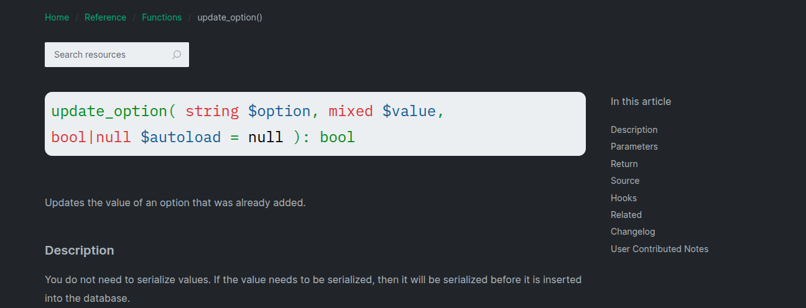
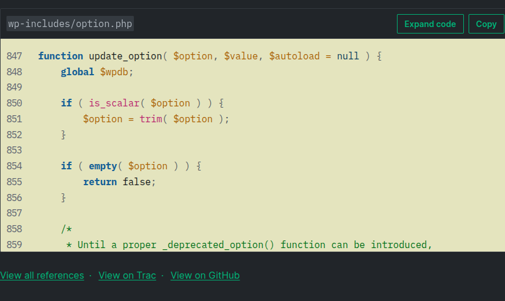

    

## DarkSyntaxWP — Browser Extension

**A dark theme extension for WordPress developers.**

 

## ✨ Features
- Theme support URL `developer.wordpress.org/*` matches.
- Sidebar option.
- Search tool option.
- Color change options.
- Flexible and easy to use

**Screenshots of before/after dark mode**

| Before       |  |  |  |
| ------------ | -------------------------------------------------------------------------- | ------------------------------------------------------------ | ------------------------------------------------------------ |
| <b>After</b> | 

 |  |  |

    <!--  -->
    

    <b>Install directly from the 
        <!-- <a href="https://chrome.google.com/webstore/detail/DarkSyntaxWP/">Chrome Web Store</a> |  -->
        <a href="https://addons.mozilla.org/en-US/firefox/addon/darksyntaxwp/">Firefox Addons</a>
    </b>

<!-- 
**File Structure**
DarkSyntaxWP/
├── src/
│   ├── background.js
│   ├── content.js
│   └── popup/
│       ├── popup.html
│       └── popup.css
│   
├── assets/
│   ├── icons/
│   │   ├── icon16.png
│   │   ├── icon48.png
│   │   └── icon128.png
│   └── screenshots/
├── readme.md
├── LICENSE
├── manifest.json
├── screenshots.md
└── .gitignore 
-->

<!-- 
### Credits
Developed with :heart: by <a href="https://github.com/suhag10">Suhag Ahmed</a> 
-->

### License

© 2025 DarkSyntaxWP. Licensed under the <a href="https://github.com/suhag10/DarkSyntaxWP#MIT-1-ov-file">MIT License</a>